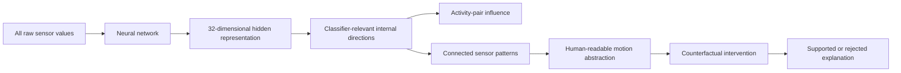

# Research Log: AI-Readable Sensor Representations

## Purpose

This file records the reasoning, experiments, decisions, and limits behind the repository. It complements the executable code and result files; it is not a replacement for them.

## Research question

Can a neural network receive all available smartphone sensor values, form an internal representation for activity classification, and then be reverse-engineered into information that a person can understand?

The target is not only to improve accuracy. The target is to identify what information remains useful for distinguishing activities:



## Dataset understanding

The raw UCI HAR input used in the new experiment contains nine channels:

- `body_acc_x`, `body_acc_y`, `body_acc_z`
- `body_gyro_x`, `body_gyro_y`, `body_gyro_z`
- `total_acc_x`, `total_acc_y`, `total_acc_z`

Each channel contains 128 measurements. The sampling rate is 50 Hz, so one window spans approximately 2.56 seconds:

```text
9 channels × 128 measurements = 1,152 input values
128 measurements ÷ 50 measurements/second = 2.56 seconds
```

A window receives one activity label from the dataset. The 2.56-second window is a dataset design choice, not a guarantee that every window contains a perfectly isolated action.

## Initial model

The new raw-sensor experiment uses a fully connected neural network, not a CNN.

```text
flat model: 1,152 → 64 → 32 → 6
wide model: 1,152 → 96 → 32 → 6
```

- Hidden layers use ReLU.
- The last layer produces six class logits.
- The largest logit is the predicted activity.
- Training uses cross-entropy loss and Adam updates.
- The 64/96 and 32 widths are design choices for a tractable baseline and an interpretable bottleneck, not dataset-proven optimal values.

Activities:

```text
walking
walking_upstairs
walking_downstairs
sitting
standing
laying
```

## Analysis sequence

### 1. Full-input training

All 1,152 raw values enter the model. No sensor subset is selected before training.

### 2. Internal representation

The 32 values immediately before the six-class output are saved conceptually as `h`:

```text
h = [h1, h2, ..., h32]
```

These values are learned combinations of earlier hidden values and raw sensor inputs. They do not have human names assigned in advance.

### 3. Internal direction extraction

The final classifier uses a weight matrix to convert `h` into six logits. A singular-value decomposition of this classifier weight matrix provides directions in the 32-dimensional hidden space that are visible to the classifier.

An internal direction is not an additional neural-network layer. It is an analysis vector found after training.

### 4. Direction influence

For a direction `u`, its component is removed from `h` and the modified representation is passed through the same output classifier. The change in activity-pair logit margins is measured.

```text
h_without_u = h - (h · u)u
```

A large margin change means that the trained model's decision relied on information along that direction. It does not prove that the direction is universally necessary for every model.

### 5. Sensor mapping

A post-hoc dictionary is computed from the raw signals:

- `level`: mean sensor level
- `variation`: time-dependent change
- `energy`: overall signal magnitude
- `slope`: average change between adjacent measurements
- `coupling`: product-based pairwise co-variation between two channels

The internal direction and these sensor features are compared with Pearson correlation. Feature ranking is fitted on the model-fitting subjects and checked on held-out validation subjects.

This is a statistical connection, not a causal proof.

### 6. Signed temporal patterns

For selected activity pairs, class-conditional mean trajectories are compared over the 128 time points. The analysis records:

- mean trajectory difference;
- largest absolute difference;
- time index of the largest difference;
- both class trajectories and their difference.

This converts `variation` into a more specific statement about how a signal differs over time.

### 7. Relation destruction

Each channel's time values are permuted within a sample. This preserves that channel's marginal values while destroying temporal alignment and cross-channel coordination.

Across two encoder variants and five seeds:

```text
flat:  mean accuracy 0.8410 → 0.5035
wide:  mean accuracy 0.8487 → 0.5129
```

This supports dependence on temporal and cross-channel structure.

### 8. Intervention control

A smoother relation intervention circularly shifts one channel in time. This preserves the channel's values and temporal smoothness more closely while changing cross-channel alignment.

The mean true-class probability change was:

```text
flat: recovered intervention 0.0458; matched control 0.0790
wide: recovered intervention 0.0364; matched control 0.0732
```

Because the matched controls had larger effects, the current evidence does not establish that the selected sensor coupling is a specific causal mechanism. The human-readable explanations remain candidate interpretations.

## Concrete observed cases

### Walking vs walking upstairs

Repeatedly strong activity pair across flat-model seeds.

Candidate connected features:

```text
total_acc_x:variation
body_acc_x:variation
body_acc_x:energy
body_gyro_z:variation
body_acc_y:variation
total_acc_x × total_acc_y:coupling
```

For flat seed 7, the selected internal direction had a walking/upstairs margin effect of approximately `8.05`. The class-conditional mean trajectory differences included:

```text
total_acc_x mean difference: 0.1060
largest absolute difference: 0.2156 at timestep 102

body_acc_x mean difference: 0.0142
largest absolute difference: 0.2478 at timestep 38
```

Safe interpretation:

> The model appears to use differences in the temporal trajectory and magnitude of acceleration, together with possible cross-axis coordination, to distinguish walking from walking upstairs.

Not established:

> A particular axis is always larger during stair climbing, or one specific sensor value is the direct cause of the decision.

### Sitting vs standing

Repeatedly strong activity pair across flat-model seeds.

Candidate connected features:

```text
total_acc_y:variation
body_gyro_y:variation
body_acc_y:variation
total_acc_z:level
```

For flat seed 7:

```text
total_acc_y mean difference: 0.6708
largest absolute difference: 0.6758 at timestep 102

total_acc_z mean difference: 0.3081
largest absolute difference: 0.3167 at timestep 125
```

Safe interpretation:

> The model appears to use device-coordinate acceleration level and small changes around a maintained posture when separating sitting from standing.

Not established:

> The y or z channel directly measures a universal human vertical axis, or that one level value is sufficient for the distinction.

### Walking upstairs vs walking downstairs

Candidate connected features:

```text
body_gyro_y:variation
total_acc_z:variation
body_acc_z:variation
total_acc_x:energy
total_acc_x × total_acc_y:coupling
```

For flat seed 7:

```text
total_acc_y mean difference: -0.2585
largest absolute difference: 0.3455 at timestep 26

total_acc_z mean difference: -0.2493
largest absolute difference: 0.3144 at timestep 102
```

Safe interpretation:

> The model appears to use the time-dependent pattern of acceleration and rotation during vertical movement to distinguish going upstairs from going downstairs.

Not established:

> A universal physical rule about which signal must be larger when going upstairs or downstairs.

## What was attempted and rejected

- The original 561-feature MLP experiments were useful exploratory work but are not the same as the new all-raw-input study.
- Test-label-based hidden-node selection was identified as leakage-prone and reanalyzed with training-subject validation selection.
- A simple recovered-sensor intervention was not accepted as causal evidence because matched controls produced larger changes.
- The new model is not described as a CNN; the actual implementation is an MLP.
- The numbers 64 and 32 are not described as optimal architecture widths.
- Latent direction indices are not treated as stable semantic names across random seeds.

## Current claim boundary

Supported by the current files and runs:

> A raw-input neural network forms a compact internal representation for activity classification. Classifier-relevant directions can be identified and connected statistically to temporal sensor variation, signal magnitude, device-coordinate levels, and cross-channel relationships. Removing temporal and cross-channel structure strongly damages classification, and the internal patterns can be described in human-readable motion terms.

Not supported yet:

> One exact raw sensor value is universally necessary.

Not supported yet:

> A named sensor relation is the physical cause of the model's decision.

Not supported yet:

> The extracted abstraction is invariant across all subjects, architectures, or sensor placements.

## File map

| Purpose | File |
|---|---|
| Overall project intent | `plan.md` |
| Human-readable workflow context | `human_understandable_model_workflow.md` |
| New experiment plan | `uci_har/reality_representation/PLAN.md` |
| Model and analysis implementation | `uci_har/reality_representation/experiment.py` |
| Signed activity-pattern analysis | `uci_har/reality_representation/temporal_pattern_analysis.py` |
| Main experiment results | `uci_har/reality_representation/results/experiment_results.json` |
| Temporal results | `uci_har/reality_representation/results/temporal_pattern_results.json` |
| Generated main report | `uci_har/reality_representation/REPORT.md` |
| Generated temporal report | `uci_har/reality_representation/TEMPORAL_REPORT.md` |
| Focused tests | `uci_har/reality_representation/test_reality_representation.py` |
