# Input-Trace Reverse-Engineering Plan

## Goal

Trace the trained raw-sensor MLP's actual decision for `walking` versus `walking_upstairs` back to the 1,152 input values, then compress the result into human-readable sensor information.

The target is not a single important hidden neuron. The target is the complete local decision direction used by the classifier at each sample.

```mermaid
flowchart LR
    accTitle: Input Decision Trace
    accDescr: The plan traces a two-class logit direction through ReLU gates to raw sensor timesteps, then explains the resulting score with sensor feature families and controlled interventions.

    raw[9 channels x 128 timesteps] --> h1[64 hidden values]
    h1 --> h2[32 hidden values]
    h2 --> logits[walking and upstairs logits]
    logits --> direction[Two-class decision direction]
    direction --> jacobian[Samplewise local input influence]
    jacobian --> pattern[Channel x timestep influence pattern]
    pattern --> features[Sensor feature dictionary]
    features --> explanation[Human-readable abstraction]
    explanation --> intervention[Selective intervention]
    intervention --> conclusion[Bounded conclusion]
```



## Fixed protocol

- Code base: `uci_har/reality_representation/experiment.py`
- Input: all 9 raw channels × 128 timesteps = 1,152 values
- Architecture: `1,152 → 64 → 32 → 6` MLP
- Variants: existing `flat` and `wide` models
- Seeds: `7, 11, 19, 23, 31`
- Validation subjects: retain the current split `(1, 3, 5, 6, 7, 8)`
- Test subjects: never used to choose directions, feature families, regression penalties, or intervention doses
- Primary pair: `walking` vs `walking_upstairs`

## Phase 1 — Save the trained models

After every seed and architecture variant is trained, save:

```text
W1, b1, W2, b2, W3, b3
```

Also save:

- seed and variant;
- subject split;
- normalization statistics;
- training configuration;
- baseline train/validation/test metrics.

The checkpoint is required because later analyses must use the exact trained parameters rather than retrain an uncontrolled replacement.

## Phase 2 — Define the complete two-class decision direction

Let `walking` be class `a` and `walking_upstairs` be class `b`.

The output-layer direction is:

```text
d_out = W3[:, a] - W3[:, b]
```

For a hidden representation `h2`, the two-class score is:

```text
score = h2 @ d_out + (b3[a] - b3[b])
```

The score is positive toward `walking` and negative toward `walking_upstairs` under this class ordering. This is a single two-class direction built from all 32 hidden coordinates.

Do not rank hidden neurons by individual weight magnitude. A neuron's effect can cancel with another neuron's effect, and correlated neurons make single-neuron rankings misleading.

## Phase 3 — Trace each sample to the raw input

For each sample, run the normal forward pass and save ReLU masks:

```text
D1 = diagonal(mask(h1))
D2 = diagonal(mask(h2))
```

Use the local linear map from the raw flattened input to the two-class score:

```text
v = W1 D1 W2 D2 d_out
```

Depending on the array convention, implement the equivalent transpose form, but verify that `v` has shape `(1152,)` and that finite differences of the score agree with `v` for a small perturbation.

Reshape:

```text
v → (9, 128)
```

Save for each sample:

- signed influence `v`;
- absolute influence `abs(v)`;
- predicted class and true class;
- score and margin;
- ReLU masks.

## Phase 4 — Compare the two activities

For `walking` and `walking_upstairs` separately, compute:

- mean signed influence by channel and timestep;
- mean absolute influence by channel and timestep;
- median and interquartile range;
- fraction of samples with positive influence at each location;
- top channel-time regions;
- bootstrap confidence intervals for aggregate differences.

Do not interpret a positive influence without fixing the score convention. Positive values increase the `walking - walking_upstairs` score; negative values favor the opposite direction.

Primary questions:

- Which channels repeatedly carry the two-class decision signal?
- Which time regions carry it?
- Is the signal concentrated at peaks, transitions, or throughout the window?
- Does the signed pattern differ between the two activities?

## Phase 5 — Build the full sensor feature dictionary

Compute features from raw signals without restricting model training.

### Per-channel families

For each channel and relevant window:

- `level`: mean and median;
- `variation`: standard deviation and mean absolute first difference;
- `energy`: mean squared amplitude and root-mean-square;
- `slope`: fitted linear slope and mean first difference;
- `peak`: maximum, minimum, and peak-to-peak range;
- `frequency`: dominant nonzero FFT frequency and spectral-band energy;
- `autocorrelation`: lag-1 and best short-lag autocorrelation;
- `periodicity`: maximum normalized autocorrelation over a predefined short-lag range.

### Cross-channel families

For every channel pair:

- zero-lag Pearson correlation;
- covariance and normalized co-energy;
- lagged correlation over a fixed lag range;
- maximum absolute lagged correlation and the lag at which it occurs;
- acceleration–gyroscope coupling features.

Record feature provenance: channel names, axis names, time range, statistic, and normalization.

## Phase 6 — Explain the actual two-class score directly

For every sample compute:

```text
score = h2 @ d_out + bias_difference
```

Do not explain a hidden axis in this phase. Explain the actual two-class decision score.

Fit explanations on the model-fitting subjects and evaluate on validation subjects:

1. Pearson correlation between each dictionary feature and `score`;
2. univariate linear regression and held-out `R²`;
3. multivariate linear regression with standardized features;
4. sparse regression with a fixed, validation-selected penalty;
5. coefficient sign and stability across resamples.

For the input influence pattern, also fit feature summaries to:

```text
sum(abs(v)) by channel/time region
sum(v) by channel/time region
```

A feature is a useful explanatory candidate only if it has:

- nontrivial fit association;
- held-out validation association in the same direction or stable magnitude;
- coefficient stability across resamples;
- a clear sensor and temporal interpretation.

## Phase 7 — Remove duplicate features

Within a feature family, calculate pairwise feature correlation on the fitting subjects.

If:

```text
|r| > 0.85
```

collapse the features into one family-level candidate. Report the representative feature and all members of the cluster.

Interpret families before exact feature names:

```text
acceleration variation
movement energy
posture / sensor level
cross-axis coordination
acceleration–rotation coupling
periodicity
```

Do not claim that the representative feature is uniquely meaningful when several correlated features are interchangeable.

## Phase 8 — Selective causal-style checks

Choose the top feature families using only fitting and validation data. For each selected family, define a raw-signal intervention that changes that structure while preserving as much unrelated structure as possible.

Controls:

- same intervention amplitude on a randomly selected matched family;
- no-intervention baseline;
- marginal-preserving permutation where applicable;
- smooth circular shift for cross-channel alignment;
- phase or spectral control for periodicity claims.

Measure on untouched test subjects:

- change in `walking - walking_upstairs` logit margin;
- prediction flip rate;
- class-specific flip rate;
- activity-pair selectivity;
- recovered-family effect minus matched-control effect.

An interpretation is promoted beyond “candidate” only when the recovered-family intervention has a larger and more selective effect than the matched control across seeds.

## Phase 9 — Seed recurrence

Do not compare raw latent direction numbers between seeds. Compare:

- recurring sensor channels;
- recurring temporal regions;
- recurring feature families;
- signed influence pattern similarity after channel/time alignment;
- held-out regression performance;
- intervention effect direction.

Report recurrence as a count or proportion:

```text
feature family X appeared in the stable top set in n / 10 model runs
```

A union of all features is not a recurrence statistic.

## Required final output

For `walking vs walking_upstairs`, produce:

- baseline accuracy by seed and variant;
- two-class score definition;
- mean signed and absolute input influence maps;
- most influential raw channels;
- most influential timestep regions;
- class-conditional signed differences;
- top feature families;
- Pearson correlation;
- validation `R²`;
- sparse coefficient and stability;
- intervention versus matched control;
- recurrence across seeds and variants;
- human-readable explanation;
- explicit unsupported claims.

## Claim boundary

A successful result may support:

> The trained model's walking-versus-upstairs score depends on a reproducible combination of specified raw sensor channels and temporal patterns. That combination can be summarized as a human-readable sensor relationship.

It may not automatically support:

> One raw sensor value is universally necessary.

It may not support:

> The recovered sensor relationship is the physical cause of the activity.

Causal language requires selective intervention to exceed matched controls. If that criterion fails, report the result as a stable computational association only.
